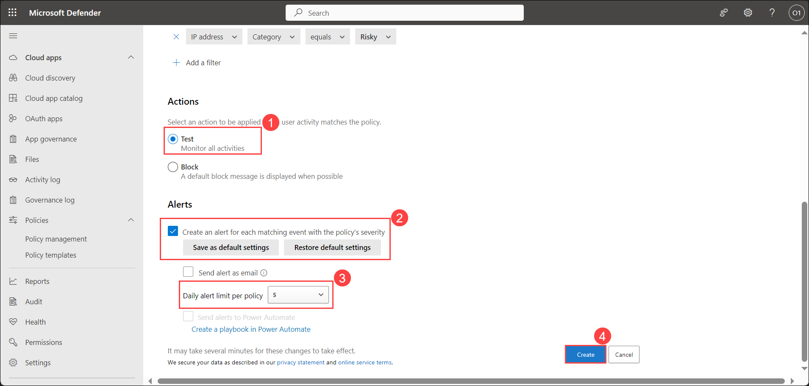

## Lab 10 - Configure App Access Policies 

## Lab scenario

App Access Policies within the Microsoft 365 Defender suite involves setting rules and controls to manage how applications are accessed and used within an organization's digital environment. By specifying access controls, such as limiting app usage to certain devices, locations, or user groups, organizations can strengthen their security posture and protect sensitive data from unauthorized access or misuse.

## Lab objectives (Duration:  minutes)

In this lab, you will complete the following tasks:
- Task 1: Create App Access Policies 

## Architecture Diagram

### Task 1: Create App Access Policies 

1. In the Microsoft Defender Portal, under **Cloud Apps**, go to **Policies -> Policy management**. Then select the **Conditional access** tab.

2. Select **Create policy** and then select **Access policy**.

   

3. In the Activities matching all of the following section, select **+ Add a filter** to apply to the policy and provide the options as depicted in the screenshot. Filters include the following options:

- Device tags
- Location
- IP address
- App

   

4. Scroll down. Select **Test** in Actions option. Under Alerts option select the checkbox of **Create an alert for each matching event with the policy's severity**. Keep the Daily alert limit per policy as **5**. Select **Create**.

   

>**Note**: You can increase/decrease the Daily alert limit per policy as per the requirement.

## Review
In this lab, you will complete the following tasks:
- Created App Access Policies
