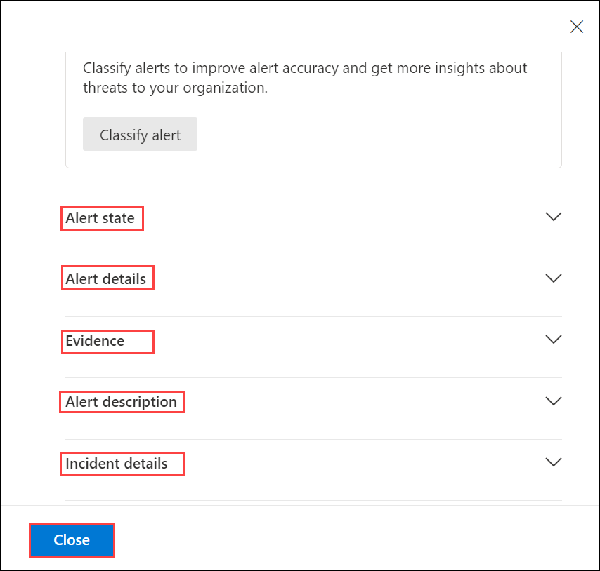

## Lab 12 - Investigate Alerts and activities

## Lab scenario
In this lab, we will explore the Microsoft Defender for Cloud Apps portal to investigate incidents and alerts. Incidents are collections of related alerts indicating potential attacks on your cloud resources. Alerts provide notifications of suspicious or malicious activities detected by Microsoft Defender for Cloud Apps.

## Lab objectives (Duration: 20 minutes)

In this lab, you will complete the following tasks:
- Exercise 1: Investigate Incidents and Alerts

## Architecture Diagram

   

### Exercise 1: Investigate Incidents and Alerts

An incident is a collection of related alerts that indicate a possible attack on your cloud resources. An alert is a notification that a suspicious or malicious activity was detected by Microsoft Defender for Cloud Apps, a cloud security solution that monitors and protects your cloud environment. We can view and manage incidents and alerts in the Security alerts page of the Defender for Cloud Apps portal

1. In the Microsoft Defender Portal, under **Cloud Apps**, go to the **App governance** and Under the **Alerts** tab click on **Take me there**.

   

   >**Note**: Another way to explore is to choose **Incidents** under **Incidents and Alerts**, then filter out incidents based on your needs.

1. On the **Incidents** page, select the **Custom policy**. It will Pop-up **Incident details**, after exploration you can click on **Close**.
   
   
   
   

1. On the **Custom Policy** Incident page under **Attack story**, click on the **Custom Policy** to get the details.
    
    - **Attack story** help you to quickly review, investigate, and remediate attacks while viewing the full story of the attack on the same tab. It also allows you to review the entity details and take remediation actions, such as deleting a file or isolating a device without losing context. Within the attack story you can find the alert page and the incident graph. The incident alert page has these sections:- Alert story, which includes: What happened, Actions taken, Related events, and Alert properties in the right pane (state, details, description, and others).   

   >**Note**: Note that not every alert will have all of the listed subsections in the Alert story section.
   
    

1. You can view the page for your **Custom policy**, scroll down to obtain all the information about the **Alert state**, **Alert details**, **Evidence**, **Alert description**, **Incident details**. Once you have reviewed every detail, click on **Close**.

   
   
   

1. Now click on **Alerts** and select **custom policy**, you will find the reason as **Policy Custom policy was violated by app demoapp**. 

   - On the Alerts tab, you can view the alert queue for alerts related to the incident and other information about them such as:

      - Severity.
      - The entities that were involved in the alert.
      - The source of the alerts (Microsoft Defender for Identity, Microsoft Defender for Endpoint, Microsoft Defender for Office 365, Defender for Cloud Apps, and the app governance add-on).
      - The reason they were linked together.

   
   
   

1. After selecting **Evidence and Response**, locate your entry under **All evidence** and found *Suspicious*. 

   - The Evidence and Response tab shows all the supported events and suspicious entities in the alerts in the incident.
   - Microsoft Defender automatically investigates all the incidents' supported events and suspicious entities in the alerts, providing you with information about important emails, files, processes, services, IP Addresses, and more. This helps you quickly detect and block potential threats in the incident.
   - Each of the analyzed entities is marked with a verdict (Malicious, Suspicious, Clean) and a remediation status. This helps you understand the remediation status of the entire incident and what next steps can be taken.

   

1. Get all the information in one location on the **Summary** tab.

   
      

## Review
In this lab, you will complete the following tasks:
- Investigate Incidents and Alerts
