## Lab 13 - Deploy Domain Controller 

## Lab scenario

In this lab, you will install Active Directory Domain Services on a pre-configured virtual machine and add 'Active Directory Domain Services' as a role, and promote the server to a domain controller. They specify domain details, set a DSRM password, configure default settings, and review options before installing. The process concludes with a successful prerequisites check, ensuring a streamlined installation of Active Directory. 
 To fully implement and benefit from Defender for Identity capabilities, one of the prerequisites is configuring the server as a domain controller. This configuration allows Defender for Identity to monitor and analyze the identity-related activities, behaviors, and potential threats within the domain environment, providing insights and enhancing security measures specifically related to user identities and authentication protocols.

## Lab objectives (Duration: 40 minutes)

In this lab, you will complete the following tasks:
- Exercise 1: Deploy Domain Controller 

## Architecture Diagram

   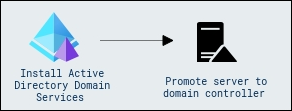

### Exercise 1: Deploy Domain Controller 

A Domain Controller (DC) is a vital component in a Windows-based network that manages security, authentication, and access control. It runs the Active Directory Domain Services (AD DS) role, storing user account information, authenticating user logins, managing permissions, and organizing network resources. Essentially, it acts as a centralized hub, controlling and coordinating access to the network's resources, ensuring security, and enforcing policies across the domain.

1. In the Azure portal, search for and select **Virtual Machines**. Select **svm-<inject key="DeploymentID" enableCopy="false" /></inject>** virtual machine. Select the **Overview > Properties** and Copy the private ip address allocated to the virtual machine.

   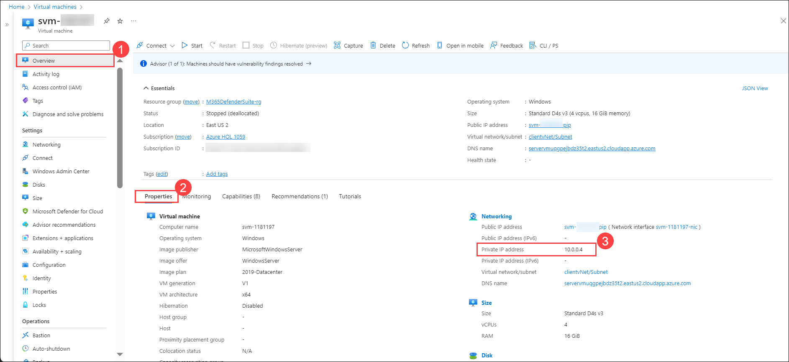

2. Select the **Networking** section within the settings of your VM from the menu on the left-hand side. Now click on the Network Interface for the VM **svm-<inject key="DeploymentID" enableCopy="false" /></inject>-nic**.

   

3. Now, click on **DNS servers**. Under DNS servers, select **Custom** and paste the private IP address of the VM which you have copied earlier in the step 1. Click on **Save**

   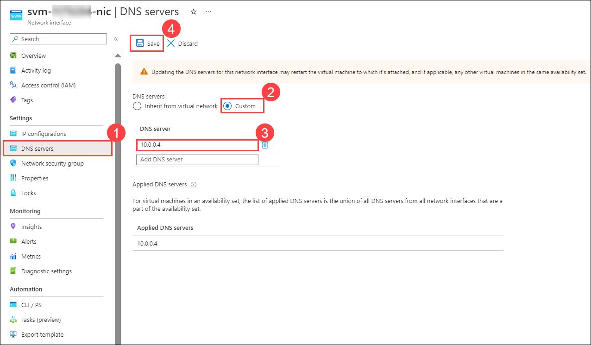

4. From the jump VM, search for **Server Manager** from the start menu and select it. Go to the server manager and click on **Add roles and features**.

   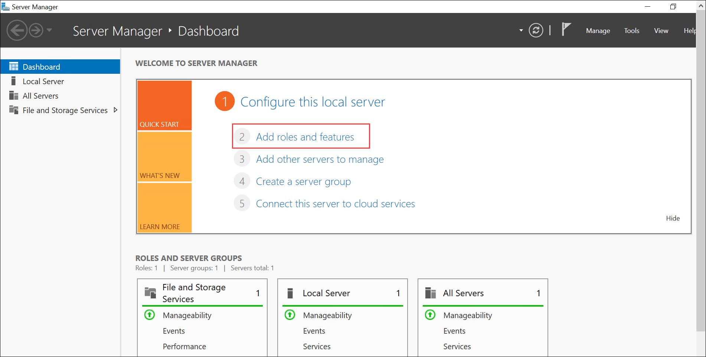

5. You will be directed to **Before you begin** tab. Click **Next**.

   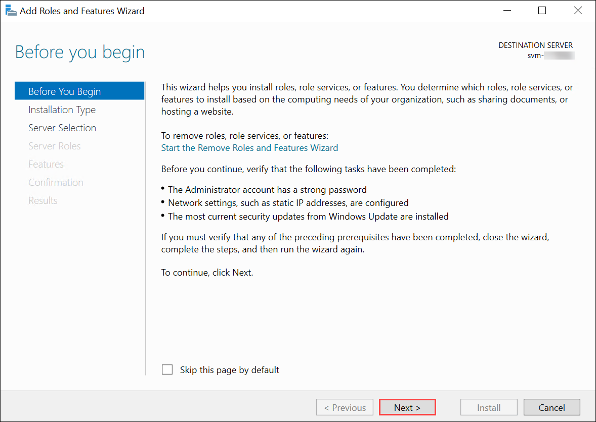

6. In the **Installation type** tab, select **Role-based or feature-based installation** and click **Next**.

   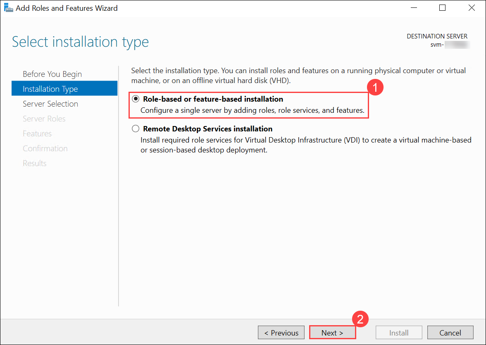

7. In the **Server Selection** tab, select **Select a server from the server pool** and then select the hostname of your server and click **Next**.

   

8. Under **Server Roles** tab, select **Active Directory Domain Services**. You will get a pop-up to add additional features. Click **Add Features** then Click **Next**.

   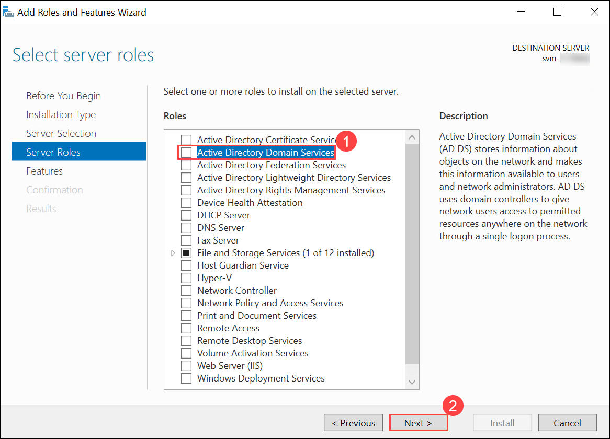

   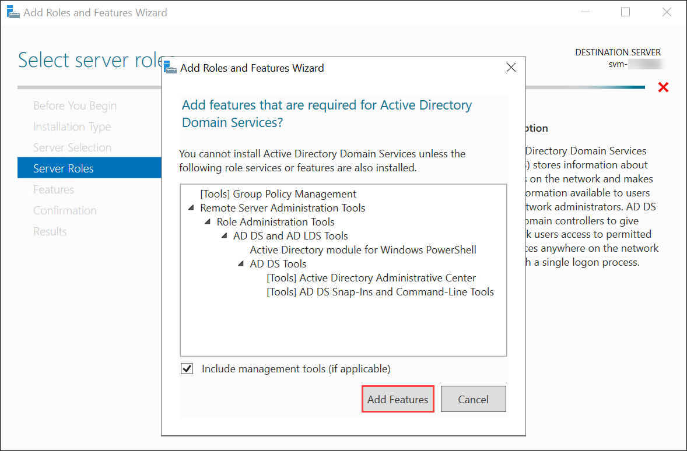

9. Now, under **Features**, you will see additional features that we can add, as no features need to be added for now so click **Next**.

   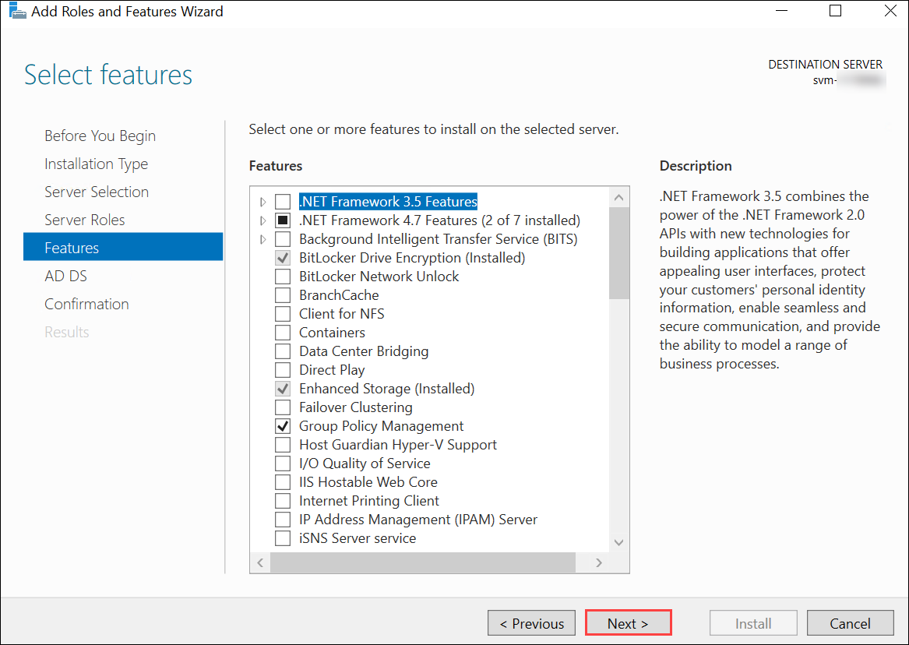

10. From the **Active Directory Domain Service** tab, Click **Next**.

    

11. In the **Confirm installation selections** tab, Click **Install**.

    

12. When finished click the flag icon in the upper right corner and click on **Promote this server to a domain controller**.

13. Now a new tab will open of Deployment configuration. Click on **Add a new forest**. Under **Root domain name** provide the domain name **contoso.com**.

    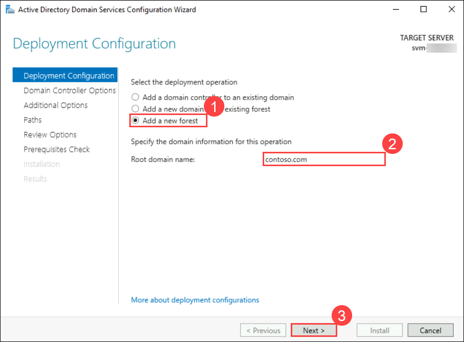

14. Under **Domain Controller Options** tab, keep the default settings and provide a DSRM password and click **Next**.

    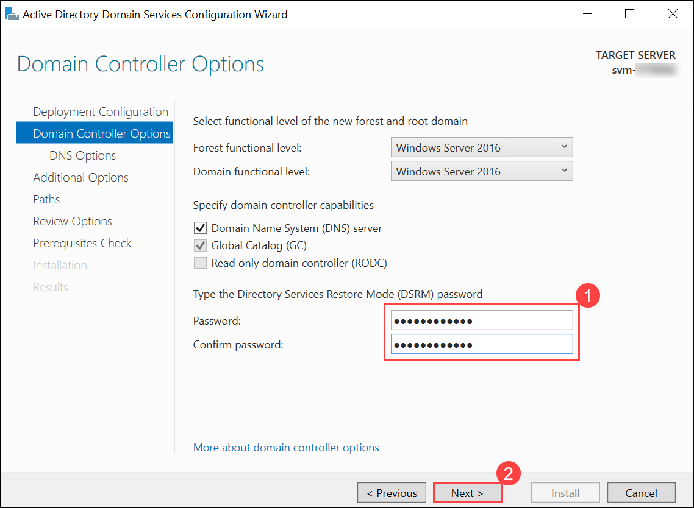

    >**Note**: Keep the DSRM password in a notepad. You will be needing DSRM password while configuring Defender for Identity sensor in the next lab.

15. In the **DNS Options** tab, Click **Next**.

16. In the **Additional Options** tab, **The NetBIOS domain name** will be automatically populated and click **Next**.

    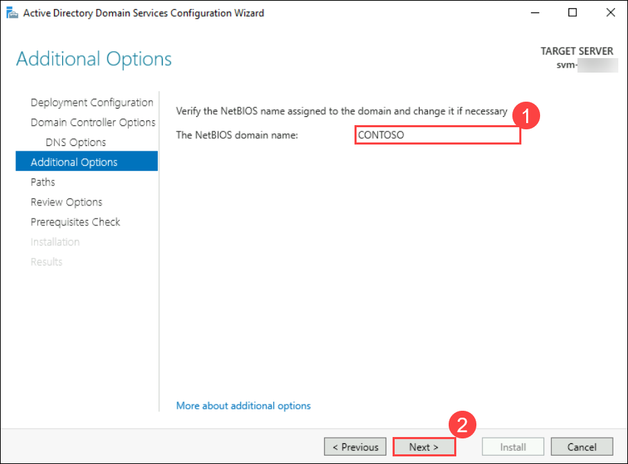

17. In **Paths** tab, keep the default paths as specified for Database folder, Log files folder and SYSVOL folder and click **Next**.

    

18. In **Review Options** tab, review your settings and click **Next**.

    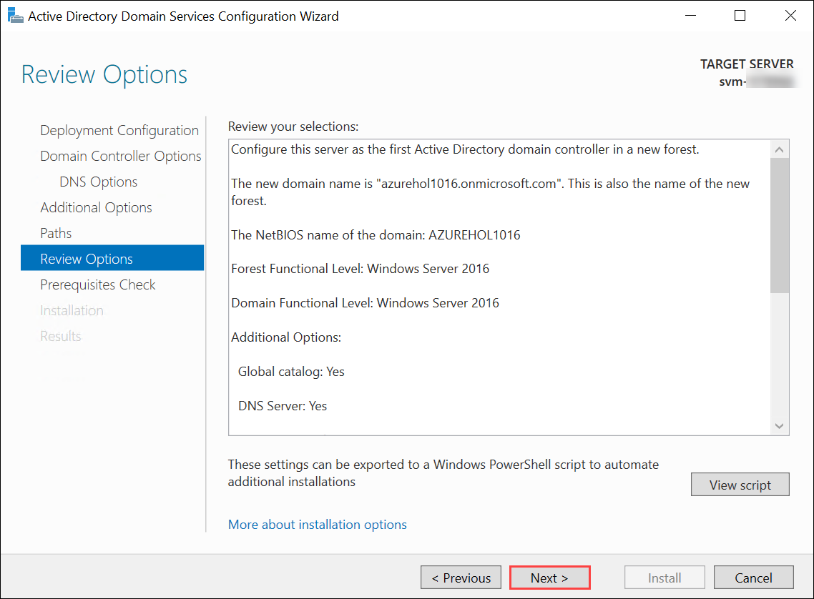

19. In **Prerequisites Check** tab, you will see All prerequisite checks passed successfully. Click on **Install**

    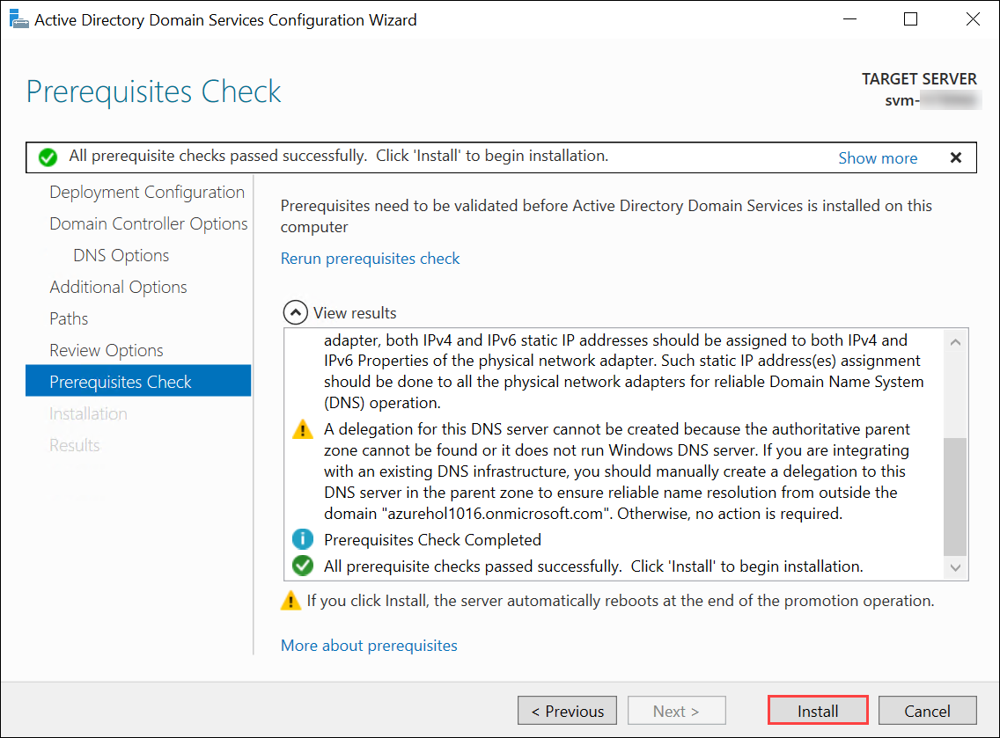

## Review
In this lab, you will complete the following tasks:
- Deploy Domain Controller

